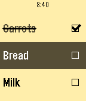

# PebbleChecklist

A checklist—on your watch!

Thanks to the Pebble's microphone and voice input, it's now possible to keep track of anything on your wrist! Designed to stay out of your way, use Checklist to keep track of anything you need without needing to hold your phone—things to-do, shopping, and more!

Grocery shopping will never be the same.

- Want to add multiple items at once? Just separate those items with periods or commas! (For example, saying "milk comma eggs comma cheese" will create 3 list items!)

- Don't want to use voice? Now you can enter items manually via your phone on the configuration page!

"...only one app, a simple list-making app called Checklist, which uses the watch's microphone to add tasks, really proved useful."
—MIT Technology Review

"I loved the convenience of adding items to the Checklist app just by speaking"
—Tom's Guide

******

Note: If voice isn't working, make sure your Pebble Time app is the newest version (3.6.1 on Android,  3.3.1 on iOS) and that your Pebble is running firmware 3.6 or higher. You can check under "Support" in the Pebble Time app.

## Want to try it?
Grab it from the Rebble/Pebble app store:
https://apps.rebble.io/en_US/application/5620e876768e7ada4e00007a?section=watchapps&dev_settings=true
